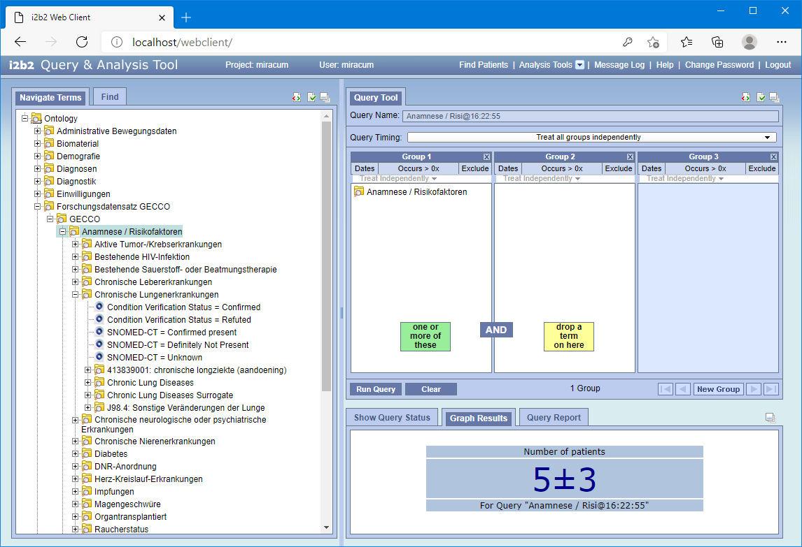

# NUM-Knoten v2

This repository contains the deployment package for the CODEX NUM-Knoten.

## Current Version (NUM-Knoten v2.0)

Currently, this version is an early release for testing purposes and does not contain all of the planned components (e.g. no GECCO-Merger that merges data from EDC and clinical source systems).

## Final Version (NUM-Knoten v2 final)

This is the target architecture for the NUM-Knoten v2 containing also the possibility to transfer data from clinical systems or other sources and merge them with data from the EDC.

Note: The FHIR-GW also provides interfaces for Apache Kafka  and for filling a FHIR server with all resources in parallel (shown with dotted lines). Though, the default and official supported way is shown with solid lines.

## Deployment on Single Host

### Start Environment

`$ sh 01_start-single-host-environment.sh`

### Stop and Delete Environment

`$ sh 02_remove-single-host-environment.sh`

### Test from FHIR-GW on

You can test the pipeline without odm2fhir by sending a FHIR resource directly to the FHIR-GW REST API when the environment is up:

`$ sh 03_send-test-resource-to-fhir-gw.sh`

### Execute (and Test) from odm2fhir on

You can test the whole pipeline by simply executing odm2fhir when the environment is up (succeeding components trigger automatically):

`$ sh 04_execute-odm2fhir.sh`

Note: The default settings use test-data in odm2fhir. To execute with real data, please set up odm2fhir/docker-compose.yml according to the documentation on <https://github.com/num-codex/odm2fhir/packages/496804>.

### Test i2b2 data integration via "i2b2 FHIR Trigger"

`$ sh 05_execute-fhir-to-i2b2.sh`

This should populate the i2b2 tables with data from the FHIR resources, in particular OBSERVATION_FACT, PATIENT_MAPPING, and PATIENT_DIMENSION. Also check table FHIR_ELT_LOG for potenial error messages.

You can also query these data with the i2b2 webclient. Go to http://localhost/webclient/ with a browser, and log in with user "miracum" and password "demouser". Use your mouse/trackpad to click on "Login" (pressing the return key may not work). You can now query for e.g. "Diagnosen" or "Forschungsdatensatz GECCO => GECCO => Anamnese / Risikofaktoren", which should return a result other than zero, as shown in the screenshot below. Note that the patient count fluctuates for each query due to the obsfuscation built into i2b2 (to improve patient privacy). Not that queries for other concepts may not return a result ("< 3" is displayed) because the demo data included it so small.

## URLs and Default Credentials

| Component                    | URL                                              | Default User | Default Password |
|------------------------------|--------------------------------------------------|--------------|------------------|
| FHIR-GW API                  | <http://localhost:18080/fhir>                    | -            | -                |
| FHIR-GW DB JDBC              | <jdbc:postgresql://localhost:15432/fhir>         | postgres     | postgres         |
| gPAS SOAP API                | <http://localhost:18081/gpas/gpasService?wsdl>   | -            | -                |
| gPAS Domain Service SOAP API | <http://localhost:18081/gpas/DomainService?wsdl> | -            | -                |
| gPAS Web UI                  | <http://localhost:18081/gpas-web>                | -            | -                |
| i2b2 Web UI                  | <http://localhost/webclient/>                    | miracum      | demouser         |
| i2b2 DB JDBC                 | <jdbc:postgresql://localhost:25432/i2b2>         | i2b2         | demouser         |
